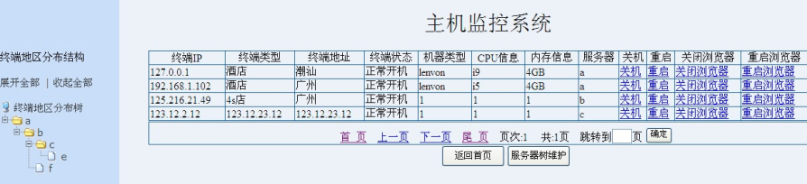

课题四、实现一个分布式主机监控系统
实验目的及要求：
该实验内容为通过socket编程技术和WEB应用开发技术实现一个分布式主机监控系统，通过服务器监控各客户主机的状态（包括系统启动、系统关机、IE启动、IE关闭），
并通过WEB网页展示主机监控功能。主机监控的功能包括监控各主机的状态、展示主机的结构关系等，系统功能界面参考如下：

实验原理和步骤： 1.实验原理
技术路线：socket+jsp+servlet，服务器与客户端使用socket通讯，服务器通过socket通讯获取客户端状态（包括系统启动、系统关机、IE启动、IE关闭），服务器监控类基于servlet实现；服务器上的展示程序基于WEB实现；客户端基本信息基于XML存储和维护。
2.实现步骤：
(1) 开发SOCKET通讯监控程序，并封装成SERVLET； (2) 搭建WEB应用框架，基于XML开发客户端主机信息管理功能（设计客户端信息XML描述文件，实现客户端信息的增删改功能）；
(3) 开发主机监控系统的WEB网页，实现监控功能； (4) 部署系统； (5) 测试系统。
